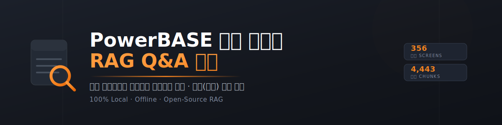
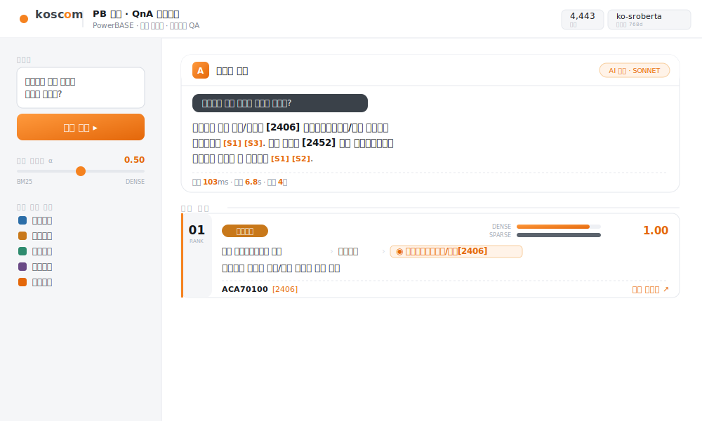

<div align="center">



# PowerBASE 계좌 매뉴얼 RAG Q&A 챗봇

**사내 원장시스템 매뉴얼을 자연어로 질문하고, 근거(출처)와 함께 답을 받는 100% 로컬 RAG 챗봇**

[](https://www.python.org/)
[](#)
[](#)
[](#)
[](#)
[](#)
[](#)
[](#)

</div>

---

## 🎯 Why RAG 챗봇?

토스증권 원장시스템(**PowerBASE**)의 온라인 매뉴얼(Adobe RoboHelp)은 **수백 개 화면**이
트리 메뉴로 흩어져 있어, 담당자가 필요한 항목을 찾으려면 매번 클릭·스크롤·검색을 반복해야 합니다.

| 기존 방식 (RoboHelp GUI) | 이 도구 (RAG 챗봇) |
|---|---|
| 트리 메뉴를 열어 화면을 하나씩 탐색 | **자연어 한 줄**로 질문 |
| 어느 화면에 있는지 알아야 찾음 | 의미로 검색 → **화면·항목 자동 매칭** |
| 답을 직접 읽고 종합 | **근거 포함 답변**을 즉시 생성 |
| 화면 간 관계 파악 어려움 | 관련화면·용어·Q&A까지 **한 번에** |
| 데이터 외부 유출 우려 | **완전 로컬·오프라인** (폐쇄망 OK) |

> **핵심:** 매뉴얼 원문을 그대로 검색 인덱스로 만들고, 검색된 근거만으로 답하게 하여
> **할루시네이션 없이 출처가 검증 가능한** 답변을 제공합니다.

---

## ✨ Key Features

- 🔎 **하이브리드 검색** — 의미(Dense 임베딩) + 키워드(BM25)를 결합, `α` 슬라이더로 실시간 조절
- 🧭 **계층 경로 보존** — `화면 > 화면설명 > 조건입력 > 상품유형 > 위탁계좌` 브레드크럼을 문맥·출처로 활용
- 💬 **근거 기반 답변** — 상단 챗봇 답변 + 하단 근거 슬립, 인용 `[S1]` 클릭 → 근거로 스크롤
- 🗂️ **계좌 섹션 전량** — RoboHelp TOC 재귀 크롤링으로 **356화면 / 4,443청크** 자동 색인
- 🔒 **100% 로컬·오프라인** — 임베딩·검색·LLM 모두 로컬, 외부 상용 API 불필요(폐쇄망 대응)
- 🎛️ **검색품질 QA 콘솔** — dense/sparse 기여도·점수·유형을 시각화해 **품질을 눈으로 검증**
- 🚀 **원클릭 배포** — 설치·색인·실행 스크립트 + Docker + systemd

---

## 🖥️ Demonstration

<div align="center">



*상단 = 최적화 답변(인용 포함) · 하단 = 근거 슬립(경로·dense/sparse·출처)*

</div>

---

## 🏗️ Architecture

**오프라인 색인(배치)** 과 **온라인 서빙(상시)** 의 2단계 구조입니다.

```
┌──────────────────── 오프라인 색인 (매뉴얼 변경 시) ────────────────────┐
│  crawl.py ─▶ parse.py ─┬─▶ to_xlsx.py ──▶ 화면별 XLSX                 │
│  (TOC 재귀   (HTML→구조 │   (샘플 포맷 재현)                            │
│   크롤링)     화 트리)   └─▶ to_chunks.py ─▶ chunks.jsonl              │
│                              (경로보존 청크)     │                     │
│                                                 ▼                     │
│                                        build_index.py                 │
│                                 (임베딩 + BM25 → data/index/)          │
└──────────────────────────────────────────┬───────────────────────────┘
                                            │
┌──────────────────── 온라인 서빙 (상시) ────┴───────────────────────────┐
│  web/index.html ◀── HTTP ──▶ webapp.py                                │
│   · 상단 답변창              ├─ /api/search  하이브리드(FAISS+BM25)     │
│   · 하단 근거 슬립           ├─ /api/answer  검색→LLM(claude|ollama|추출)│
│   · 인용 [S#] ↔ 슬립         └─ /api/meta                              │
└────────────────────────────────────────────────────────────────────────┘
```

### 파이프라인

| 단계 | 스크립트 | 입력 → 출력 | 핵심 |
|---|---|---|---|
| ① 수집 | `crawl.py` | TOC → `data/html/` | RoboHelp `toc147.new.js` **재귀 파싱**으로 356토픽 발견 |
| ② 파싱 | `parse.py` | HTML → 구조화 dict | CSS class 기반 **계층 복원** (품질의 핵심) |
| ③ 엑셀 | `to_xlsx.py` | dict → `data/xlsx/` | 수작업 샘플과 동일 B/C 2열 포맷 |
| ④ 청크 | `to_chunks.py` | dict → `chunks.jsonl` | 브레드크럼 1개 = 청크 1개, 경로 보존 |
| ⑤ 색인 | `build_index.py` | 청크 → `data/index/` | 로컬 임베딩(FAISS) + BM25 |

### 파서 계층 복원 규칙 (`parse.py`)

- `div.title_box`(대분류) → `div.Step00_icon`(중분류) → `div.Step1_Nxx`(단계)
- `th`=항목명, `td>ul>li` = 항목 · `li.icon01/icon02` 중첩 깊이로 부모-자식 복원
- `bground_blue` 셀은 `"용어 : 설명"` 첫 콜론 분리 · `table.T_QAbox` → Q&A
- 테이블이 **자식/형제 어느 쪽으로 파싱돼도** 처리, 테이블 없는 화면은 `div.h2` 보존

---

## ⚡ Quick Start (로컬)

```bash
# 1) 설치 (uv 오픈소스 파이썬/패키지 관리자 자동 사용)
curl -LsSf https://astral.sh/uv/install.sh | sh
uv venv --python 3.12 .venv
uv pip install --python .venv/bin/python -r requirements.txt \
    --extra-index-url https://download.pytorch.org/whl/cpu

# 2) 색인 (사내망; 최초 1회 임베딩 모델 ~440MB 다운로드 후 오프라인)
PY=.venv/bin/python
$PY src/crawl.py --from-file data/account_topics.txt
$PY src/to_chunks.py data/html/*.html
$PY src/build_index.py

# 3) 실행
PORT=8000 $PY src/webapp.py        # → http://localhost:8000
```

---

## 🐧 리눅스 서버 배포 (프로덕션)

일반 리눅스 서버(Ubuntu/Debian/RHEL, x86_64)에 **3단계**로 배포합니다. root 불필요.

### 방식 A — 스크립트 + systemd (권장)

```bash
git clone https://github.com/humanist96/pb_online_manual_chatbot.git
cd pb_online_manual_chatbot

bash deploy/install.sh     # ① venv + 의존성 부트스트랩
bash deploy/build.sh       # ② 색인 빌드 (사내망)
bash deploy/run.sh         # ③ 실행 → http://<서버IP>:8000
```

상시 실행(부팅 자동시작·크래시 재시작):

```bash
sudo cp deploy/pb-chatbot.service /etc/systemd/system/   # User/경로 수정 후
sudo systemctl daemon-reload && sudo systemctl enable --now pb-chatbot
journalctl -u pb-chatbot -f
```

> `make install && make build && make run` 으로도 동일하게 실행됩니다.

### 방식 B — Docker

```bash
bash deploy/build.sh        # 호스트에서 data/(색인) 준비
docker compose up -d        # → http://<서버IP>:8000
```

> 이미지에는 **코드만** 포함되고, 색인(`./data`)·모델 캐시는 볼륨으로 주입됩니다(사내 데이터 보호).
> 폐쇄망 자체완결 답변이 필요하면 `docker-compose.yml`의 **Ollama 서비스** 주석을 해제하세요.

| 배포 파일 | 용도 |
|---|---|
| `deploy/install.sh` · `build.sh` · `run.sh` | 설치 · 색인 · 실행 |
| `deploy/pb-chatbot.service` | systemd 유닛(자동 재시작) |
| `Dockerfile` · `docker-compose.yml` | 컨테이너 배포 |
| `requirements.lock.txt` · `Makefile` | 고정버전 설치 · 편의 명령 |

---

## 🔧 설정 (환경변수)

| 변수 | 기본값 | 설명 |
|---|---|---|
| `EMBED_MODEL` | `jhgan/ko-sroberta-multitask` | 임베딩 모델(경량). 고정밀: `BAAI/bge-m3` |
| `LLM_BACKEND` | `auto` | `auto`(claude→ollama→추출) · `claude` · `ollama` · `none` |
| `CLAUDE_MODEL` / `LLM_MODEL` | `sonnet` / `qwen2.5:7b-instruct` | Claude CLI / Ollama 모델 |
| `RAG_TOPK` / `RAG_ALPHA` | `5` / `0.5` | 검색 상위 k / 혼합 가중치 |
| `HOST` / `PORT` | `0.0.0.0` / `8000` | 바인딩 주소·포트 |

---

## 🧰 Tech Stack

| 영역 | 기술 |
|---|---|
| 파싱 | `beautifulsoup4` · `lxml` |
| 임베딩 | `sentence-transformers` (`ko-sroberta`, 옵션 `bge-m3`) |
| 검색 | `faiss-cpu`(dense) · `rank-bm25`(sparse) · 한국어 토크나이저 |
| LLM | 로컬 **Ollama** / 로컬 **Claude Code CLI** / 추출-합성 폴백 |
| 서버·UI | Python 표준 `http.server` · 오프라인 단일 HTML(KOSCOM 테마) |
| 배포 | uv · Docker · systemd |
| **외부 상용 API** | **없음** (완전 오프라인 실행 가능) |

---

## ❓ FAQ

**Q. 인터넷 없이 되나요?**
A. 네. 임베딩 모델만 최초 1회 캐시하면 `HF_HUB_OFFLINE=1`로 완전 오프라인 동작합니다.

**Q. 왜 저장소에 매뉴얼 데이터가 없나요?**
A. 사내 금융시스템 원문 유출 방지를 위해 `data/`(HTML·색인·XLSX)는 `.gitignore`로 제외합니다.
사내망에서 `crawl.py` → `build_index.py`로 재생성합니다.

**Q. LLM 없이도 답하나요?**
A. 네. Ollama/Claude CLI가 없으면 **추출-합성 폴백**이 상위 근거를 출처와 함께 제시합니다.

**Q. GPU가 필요한가요?**
A. 아니요. CPU 전용으로 동작합니다(경량 3B 모델 권장, RAM 8GB면 충분).

---

## 🗺️ 로드맵

데이터 정제(중복·보일러플레이트 제거) → 답변 **스트리밍(SSE)** → 로컬 **리랭커**(`bge-reranker-v2-m3`)
→ 임베딩 업그레이드 → 쿼리 이해·섹션 필터 → 피드백 수집·자동 평가(Recall@k/MRR).
상세는 [`기획.md`](기획.md) 참조.

---

## 📄 License

사내 이용(Internal Use). 매뉴얼 콘텐츠 저작권은 토스증권/코스콤에 있습니다.

<div align="center">
<sub>Built for PowerBASE 원장시스템 · 100% Local RAG</sub>
</div>
